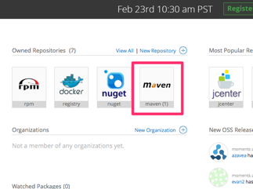
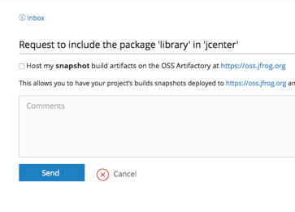

### Share our project in JCenter 

1.  Register for an account on bintray.com

2.  Package aar and upload

    [bintray-release](https://github.com/novoda/bintray-release), it provides an easy way to release your Android and other artifacts to bintray.
    
    Refer the steps in [README.md](https://github.com/novoda/bintray-release/blob/master/README.md). 
    
    * modify `publish` closure in `build.gradle`
    
```groovy
         publish {
             userOrg = ''
             groupId = ''
             artifactId = ''
             publishVersion = ''
             desc = ''
             website = ''
         }
```
    
    * use the task `bintrayUpload` to publish (make sure you build the project first!):
    
```bash
    $ ./gradlew clean build bintrayUpload -PbintrayUser=BINTRAY_USERNAME -PbintrayKey=BINTRAY_KEY -PdryRun=false
```

3.  Sync bintray user repository to jcenter

    * You now have your own Maven Repository on Bintray which is ready to be uploaded to the library.
    
    [](https://github.com/greycats/survata-android-sdk/blob/development/step1.png)

    * Nothing to do but click Send
    
    [](https://github.com/greycats/survata-android-sdk/blob/development/step2.png)


    * It is pretty easy to sync your library to jcenter. Just go to the web interface and simply click at "Add to JCenter".
    Nothing we can do now but wait for 2-3 hours to let bintray team approves our request. Once sync request is approved, you will receive an email informing you the change. 
    
    [](https://github.com/greycats/survata-android-sdk/blob/development/step3.png)
